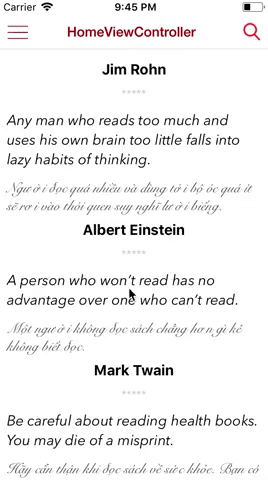

# mtnavigationbar
Custom Navigationbar. A replacement system UINavigationBar

# Requirements
Xcode 9.0+

iOS 8.0+

Interoperability with Swift 4.0+

# Installation
CocoaPods (coming soon)

# Getting Started
$ git clone git@github.com:phamminhtien305/mtnavigationbar.git

$ git checkout master

$ cd MTNavigationBarView/

$ open MTNavigationBarView.xcodeproj

# Our Getting Started guide
Clone my repo you can see custom navigation bar view class. You can drap drop it into your project. 

For Setup standard navigation bar:

    initNaviBarSearchButton(onView: self, withTitle: self.nibName)
For setup Search navigation bar:

    initNaviBarSearch(onView: self, withTitle: self.nibName)
    
For setup Library navigation bar:

    initNavigationForListBookLibrary(onView: self, withTitle: self.nibName)

# MTNavigationBar protocol:
    @objc protocol NavigationHandle {
        @objc optional func navigationBarView(_ navigationView: NavigationBarView, clickLeftMenu sender: AnyObject)
        @objc optional func navigationBarView(_ navigationView: NavigationBarView, clickRightMenu sender: AnyObject)
        @objc optional func navigationBarView(_ navigationView: NavigationBarView, clickOtherMenu sender: AnyObject)
        @objc optional func navigationBarView(_ navigationView: NavigationBarView, clickDropdown sender: AnyObject)
        @objc optional func navigationBarView(_ navigationView: NavigationBarView, clickSearch sender: AnyObject)
        @objc optional func navigationBarView(_ navigationView: NavigationBarView, searchWithText keyword: String?)
        @objc optional func navigationBarView(_ navigationView: NavigationBarView, clickDelete sender: AnyObject)
        @objc optional func navigationBarView(_ navigationView: NavigationBarView, clickDeleteAll sender: AnyObject)
    } 
    
# Implement NavigationHandle 
For Example:

    extension HomeViewController: NavigationHandle {
        func navigationBarView(_ navigationView: NavigationBarView, clickLeftMenu sender: AnyObject) {
            // Implement handle when click menu button.
        }
        func navigationBarView(_ navigationView: NavigationBarView, clickSearch sender: AnyObject) {
            // Implement handle when click search button.
        }   
    }

Please let me know if you have any question!
